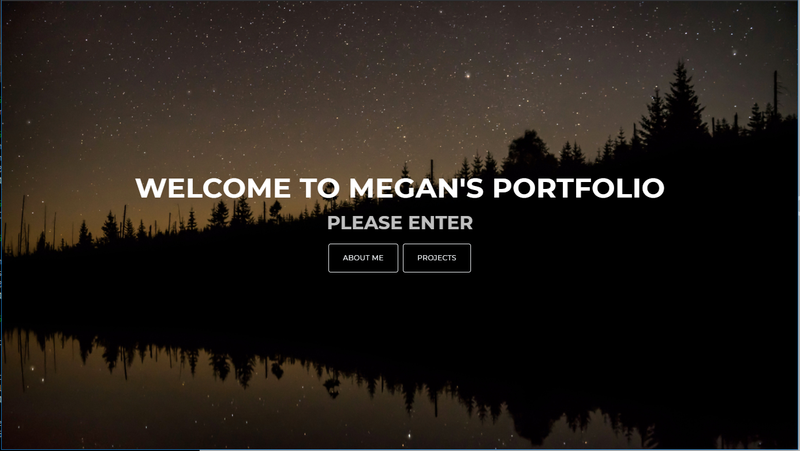
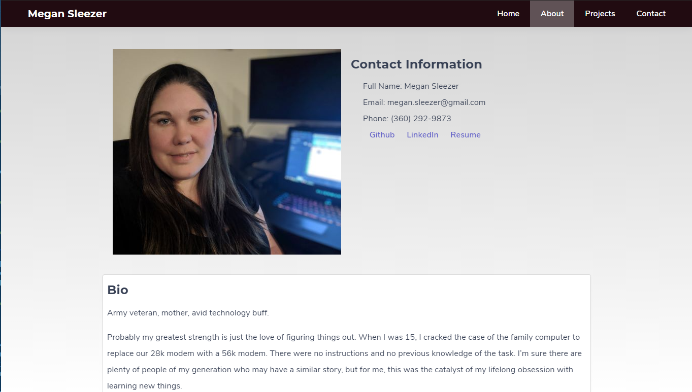

# mslee001.github.io

Link to portfolio: https://mslee001.github.io/

My portfolio website created using ciruss css framework, a grid system, and semantic html to create a responsive layout to be viewed on a variety of devices and screen sizes including phones, tablets, laptops, and larger computer monitors.

Screenshot: 
